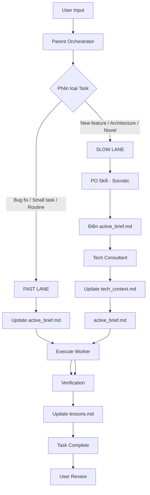

# Thiết kế Hybrid Archon: "Think Deep, Write Simple"
## System 1 vs System 2 - Kiến trúc Lai Tối Ưu

---

## 1. Triết lý Cốt Lõi

### 1.1 Vấn đề Cần Giải Quyết
- **Archon Original:** Quá phức tạp, 23 skills, deep nesting, slow
- **Project Memory System:** Quá đơn giản, mất tư duy phản biện, chất lượng thấp
- **Hybrid Archon:** Tận dụng ưu điểm cả hai, loại bỏ nhược điểm

### 1.2 Mental Model: System 1 vs System 2 (Daniel Kahneman)

```
┌─────────────────────────────────────────────────────────┐
│              HYBRID ARCHON ARCHITECTURE                 │
├─────────────────────────────────────────────────────────┤
│                                                          │
│  SYSTEM 1 (FAST LANE)      SYSTEM 2 (SLOW LANE)         │
│  ┌─────────────────┐       ┌─────────────────┐         │
│  │ Memory Driven   │       │ Skill Driven    │         │
│  │                 │       │                 │         │
│  │ • Bug fixes     │       │ • New features  │         │
│  │ • Small tasks   │       │ • Architecture  │         │
│  │ • Routine work  │       │ • Novel problems│         │
│  │                 │       │                 │         │
│  │ Speed: 15min    │       │ Speed: 1hr      │         │
│  │ Quality: Medium │       │ Quality: High   │         │
│  └─────────────────┘       └─────────────────┘         │
│           │                       │                    │
│           └──────────┬────────────┘                    │
│                      ▼                                 │
│              ┌───────────────┐                        │
│              │  4 MEMORY     │                        │
│              │  FILES        │                        │
│              │               │                        │
│              │ • active_brief.md      │                        │
│              │ • tech_context.md      │                        │
│              │ • lessons.md          │                        │
│              │ • roadmap.md          │                        │
│              └───────────────┘                        │
└─────────────────────────────────────────────────────────┘
```

### 1.3 Nguyên Tắc "Think Deep, Write Simple"

**Quy trình suy nghĩ (Skills) = Phức tạp**
- PO Skill với Socratic Method
- Tech Consultant với Trade-off Analysis
- PM Skill với Task Decomposition

**Đầu ra (Output) = Đơn giản**
- Tất cả tri thức nén vào 4 file Memory
- Không tạo file rác
- File system sạch sẽ

---

## 2. Cấu Trúc Bộ Nhớ (Memory System)

### 2.1 4 File Cốt Lõi

```
.cursor/memory/
├── active_brief.md      # RAM - Task hiện tại
├── tech_context.md      # ROM - Tech stack + decisions
├── lessons.md          # Experience - Bugs + fixes
└── roadmap.md          # Vision - Features lớn
```

### 2.2 Chi tiết từng file

#### `active_brief.md` - RAM (Ngắn hạn)
```markdown
# ACTIVE BRIEF: [Tên Task]
> Status: PLANNING | IN_PROGRESS | DONE
> Created: [YYYY-MM-DD]
> Updated: [YYYY-MM-DD]

## Goal
[Mô tả mục tiêu task cụ thể]

## Constraints
- Xem `tech_context.md`: [Tech stack reference]
- Xem `lessons.md`: [Lessons learned]
- [Ràng buộc khác]

## Acceptance Criteria
- [ ] [Criteria 1]
- [ ] [Criteria 2]
- [ ] [Criteria 3]

## Todo
- [ ] Task 1
- [ ] Task 2
- [ ] Task 3

## Technical Notes
[Ghi chú kỹ thuật từ Tech Consultant nếu có]

## Risks & Blockers
- [Risk 1]: [Mitigation]
- [Blocker 1]: [Workaround]
```

#### `tech_context.md` - ROM (Dài hạn)
```markdown
# TECH CONTEXT: [Tên Dự án]

## 1. Tech Stack
- **Framework:** [Next.js 14 / React / Vue]
- **Language:** [TypeScript / JavaScript]
- **Styling:** [TailwindCSS / CSS Modules]
- **Database:** [PostgreSQL / MongoDB]
- **Auth:** [Firebase Auth / NextAuth]
- **Deployment:** [Vercel / Netlify]

## 2. Architecture Decisions (ADRs)
### ADR-001: [Tên quyết định]
- **Context:** [Tại sao ra quyết định này]
- **Decision:** [Quyết định là gì]
- **Consequences:** [Hệ quả]
- **Date:** [YYYY-MM-DD]

### ADR-002: [Tên quyết định khác]
...

## 3. Design Patterns
- [Pattern 1]: [Mô tả]
- [Pattern 2]: [Mô tả]

## 4. Security Guidelines
- [Guideline 1]
- [Guideline 2]

## 5. Performance Requirements
- [Requirement 1]
- [Requirement 2]
```

#### `lessons.md` - Experience (Kinh nghiệm)
```markdown
# LESSONS LEARNED

## Bugs & Fixes
### Bug-001: Hydration Error
- **Symptom:** [Mô tả lỗi]
- **Root Cause:** [Nguyên nhân]
- **Fix:** [Cách sửa]
- **Prevention:** [Cách phòng ngừa]
- **Date:** [YYYY-MM-DD]

### Bug-002: [Tên lỗi khác]
...

## Best Practices
- [Practice 1]: [Mô tả]
- [Practice 2]: [Mô tả]

## Anti-Patterns
- [Anti-pattern 1]: [Tại sao tránh]
- [Anti-pattern 2]: [Tại sao tránh]
```

#### `roadmap.md` - Vision (Tầm nhìn)
```markdown
# ROADMAP

## Completed Features
- [x] [Feature 1] - [Date]
- [x] [Feature 2] - [Date]

## In Progress
- [ ] [Feature 1] - [Priority: High]
- [ ] [Feature 2] - [Priority: Medium]

## Planned Features
- [ ] [Feature 1] - [Priority: High]
- [ ] [Feature 2] - [Priority: Medium]
- [ ] [Feature 3] - [Priority: Low]

## Technical Debt
- [ ] [Debt 1] - [Priority: Low]
- [ ] [Debt 2] - [Priority: Medium]
```

---

## 3. Smart Routing Logic

### 3.1 Bộ Điều Hướng Thông Minh

Parent Orchestrator hoạt động như một "Switch" thông minh:



### 3.2 Quy tắc Phân loại Task

| Loại Task | Lane | Quy trình | Thời gian |
|-----------|------|-----------|-----------|
| Bug fix | Fast | Brief → Execute → Lessons | 15min |
| Small task (< 2 files) | Fast | Brief → Execute → Lessons | 15min |
| Routine work | Fast | Brief → Execute → Lessons | 15min |
| New feature | Slow | PO → Tech → Brief → Execute | 1hr |
| Architecture change | Slow | PO → Tech → Brief → Execute | 1.5hr |
| Novel problem | Slow | PO → Tech → Brief → Execute | 2hr |

### 3.3 Keywords Trigger

**Fast Lane Keywords:**
- "fix", "bug", "error"
- "update", "change", "modify"
- "add button", "add component"
- "small task", "quick fix"

**Slow Lane Keywords:**
- "feature", "new feature", "implement"
- "architecture", "design", "system"
- "refactor", "restructure"
- "#architect", "#po", "#slow" (explicit tags)

**Fast Lane Override Keywords:**
- "#fast", "#quick" (force Fast Lane)

---

## 4. Cách Skills Tương Tác Với Memory

### 4.1 PO Skill (Socratic Method)

**Trigger:** User yêu cầu Feature mới mơ hồ hoặc task phức tạp

**Quy trình:**
1. Chat với User với Socratic Method:
   - "Is that true?" - Xác thực giả định
   - "What is the real problem?" - Xác định vấn đề gốc
   - "What if?" - Khám phá phương án
2. Phân tích yêu cầu sâu
3. Tự động điền vào `active_brief.md`:
   - Goal (đã làm rõ)
   - Acceptance Criteria (đã xác định)
   - Constraints (đã rút ra)
4. Trả về User để xác nhận

**Output:** `active_brief.md` được điền đầy đủ

**Không tạo file rác:** Không tạo `/pm/user_stories/xxx.md`

### 4.2 Tech Consultant Skill

**Trigger:** 
- `active_brief.md` có yêu cầu kỹ thuật phức tạp
- User gắn tag `#architect`
- Task thuộc Slow Lane

**Quy trình:**
1. Đọc `active_brief.md` để hiểu yêu cầu
2. Phân tích Trade-offs:
   - Pros/Cons của các phương án
   - Security implications
   - Performance impact
3. Tạo ADR mới nếu cần
4. Cập nhật vào `tech_context.md`:
   - Thêm ADR mới
   - Cập nhật Design Patterns
   - Ghi Security Guidelines
5. Ghi Technical Notes vào `active_brief.md`

**Output:** 
- `tech_context.md` được cập nhật
- `active_brief.md` có thêm Technical Notes

**Không tạo file rác:** Không tạo `/arch/adrs/xxx.md`, `/arch/tech_specs/xxx.md`

### 4.3 Execute Worker

**Trigger:** `active_brief.md` đã có đầy đủ thông tin

**Quy trình:**
1. Đọc `active_brief.md` → Hiểu task
2. Đọc `tech_context.md` → Hiểu tech stack
3. Đọc `lessons.md` → Tránh lỗi cũ
4. Implement code:
   - Viết code theo spec
   - Chạy tests
   - Áp dụng best practices
5. Nếu gặp lỗi:
   - Ghi vào `lessons.md`
   - Fix và retry
6. Đánh dấu task Done trong `active_brief.md`

**Output:** Code được implement, `lessons.md` được cập nhật

### 4.4 PM Skill (Optional)

**Trigger:** Feature lớn cần chia nhỏ

**Quy trình:**
1. Đọc `active_brief.md` → Hiểu scope
2. Chia nhỏ thành sub-tasks
3. Tạo multiple `active_brief.md` files:
   - `active_brief-001.md`
   - `active_brief-002.md`
   - v.v.
4. Update `roadmap.md`

**Output:** Multiple brief files, `roadmap.md` cập nhật

---

## 5. Quy Trình Vận Hành

### 5.1 One-time Setup

**Bước 1: Tạo Memory Structure**
```bash
# Script init_project.py
mkdir -p .cursor/memory/
touch .cursor/memory/active_brief.md
touch .cursor/memory/tech_context.md
touch .cursor/memory/lessons.md
touch .cursor/memory/roadmap.md
```

**Bước 2: Tạo Rule File**
```markdown
# .cursor/rules/archon-hybrid.mdc
You are Hybrid Archon.

ALWAYS:
1. Phân loại task (Fast Lane vs Slow Lane)
2. Fast Lane: Update active_brief.md → Execute → Update lessons.md
3. Slow Lane: Call PO Skill → Call Tech Skill → Update files → Execute
4. NEVER write to .project_contexts/
5. ALWAYS compress knowledge into 4 memory files
```

**Bước 3: Khởi tạo Tech Context**
- User điền tech stack vào `tech_context.md`
- User ghi mục tiêu dự án vào `roadmap.md`

### 5.2 Daily Workflow

**Scenario 1: Bug Fix (Fast Lane)**
```
User: "Fix hydration error in Header component"
Archon: 
  1. Update active_brief.md với task
  2. Read lessons.md → Check nếu đã gặp lỗi này
  3. Execute fix
  4. Update lessons.md nếu là bug mới
  5. Done
```

**Scenario 2: New Feature (Slow Lane)**
```
User: "#po Implement Google Login"
Archon:
  1. Detect: "#po" + "New feature" → Slow Lane
  2. Call PO Skill:
     - Chat: "Is that true? What's the real problem?"
     - Clarify requirements
     - Fill active_brief.md
  3. Call Tech Consultant:
     - Analyze trade-offs
     - Update tech_context.md với ADR
  4. Execute Worker:
     - Implement code
     - Update lessons.md
  5. Done
```

**Scenario 3: Architecture Change (Slow Lane)**
```
User: "#architect Refactor to use Redux for state management"
Archon:
  1. Detect: "#architect" + "Architecture change" → Slow Lane
  2. Call PO Skill:
     - "Is that true? Why Redux?"
     - Validate need
     - Fill active_brief.md
  3. Call Tech Consultant:
     - Deep analysis
     - Create ADR-XXX
     - Update tech_context.md
  4. Execute Worker:
     - Implement refactoring
     - Update lessons.md
  5. Done
```

**Scenario 4: Manual Override**
```
User: "#fast Update button color to blue"
Archon:
  1. Detect: "#fast" → Force Fast Lane
  2. Update active_brief.md
  3. Execute immediately
  4. Done
```

**Scenario 5: Force Deep Analysis**
```
User: "#slow Add simple text component"
Archon:
  1. Detect: "#slow" → Force Slow Lane
  2. Call PO Skill (even though task is simple)
  3. Process as Slow Lane
  4. Done
```

---

## 6. Roadmap Triển Khai

### Phase 1: Foundation (1 ngày)
- [ ] Tạo script `init_project.py`
- [ ] Tạo 4 memory files
- [ ] Tạo `.cursor/rules/archon-hybrid.mdc`
- [ ] Test initialization

### Phase 2: Smart Routing (2 ngày)
- [ ] Implement classification logic
- [ ] Update agent-orchestrator skill
- [ ] Test Fast Lane workflow
- [ ] Test Slow Lane workflow

### Phase 3: Port Critical Skills (2 ngày)
- [ ] Refactor PO Skill → Output to active_brief.md
- [ ] Refactor Tech Consultant → Output to tech_context.md
- [ ] Remove old file creation logic
- [ ] Test skill integration

### Phase 4: Testing & Validation (1 ngày)
- [ ] Test bug fix scenario
- [ ] Test new feature scenario
- [ ] Test architecture change scenario
- [ ] Verify memory consistency

### Phase 5: Documentation (0.5 ngày)
- [ ] Write user guide
- [ ] Document workflow
- [ ] Create examples

---

## 7. So Sánh Với Các Phiên Bản

| Dimension | Archon Original | Project Memory | Hybrid Archon |
|-----------|----------------|----------------|---------------|
| **Speed (Routine)** | 1hr | 15min | **15min** ✅ |
| **Speed (Complex)** | 1hr | 15min | **1hr** ✅ |
| **Quality (Routine)** | High | Medium | **Medium** ✅ |
| **Quality (Complex)** | High | Low | **High** ✅ |
| **Complexity** | Very High | Very Low | **Medium** ✅ |
| **File System** | Messy | Clean | **Clean** ✅ |
| **Socratic Method** | ✅ | ❌ | **✅** ✅ |
| **Tech Design** | ✅ | ❌ | **✅** ✅ |
| **Maintainability** | Low | High | **High** ✅ |

---

## 8. Risk Mitigation

### Risk 1: Classification Errors
**Problem:** Orchestrator phân loại sai task
**Mitigation:** 
- Explicit keywords trigger
- User can override with tags (#fast, #slow)
- Fallback to Slow Lane if uncertain

### Risk 2: Memory Overload
**Problem:** 4 files quá lớn
**Mitigation:**
- Auto-archiving old lessons
- Summarization for large files
- Version control for history

### Risk 3: Skill Conflicts
**Problem:** Skills overwrite each other
**Mitigation:**
- Clear ownership rules
- Conflict detection
- Manual resolution prompt

---

## 9. Success Metrics

### Metrics theo Phase
- **Phase 1-2:** Memory files created, routing works
- **Phase 3:** Skills output to memory correctly
- **Phase 4:** End-to-end scenarios pass

### Metrics theo Use Case
- **UC-01 (Init):** < 5s ✅
- **UC-02 (Analysis):** Socratic maintained ✅
- **UC-03 (Design):** Tech design maintained ✅
- **UC-05 (Execute):** Fast lane 15min, slow lane 1hr ✅
- **UC-07 (Report):** Read 4 files vs 113 references ✅

### Metrics theo Quality
- **Bug rate:** Giảm 50% (nhờ lessons.md)
- **Task completion:** Tăng 80% (nhờ routing)
- **User satisfaction:** > 90%

---

## 10. Kết Luận

### Tại sao Hybrid Archon là Giải Pháp Tốt Nhất?

1. **Giữ được linh hồn của Archon:**
   - Socratic Method (PO Skill)
   - Technical Design (Tech Consultant)
   - Deep analysis cho complex tasks

2. **Tận dụng ưu điểm của Project Memory:**
   - Fast lane cho routine tasks
   - Clean file system
   - Easy maintenance

3. **Smart Routing:**
   - Tự động phân loại task
   - Tối ưu resource usage
   - Balance speed vs quality

4. **Think Deep, Write Simple:**
   - Quy trình suy nghĩ phức tạp
   - Đầu ra đơn giản, gọn gàng
   - Không tạo file rác

### Next Steps
1. Review thiết kế này
2. Feedback và điều chỉnh
3. Bắt đầu Phase 1 implementation

---

**Phiên bản:** 1.0  
**Ngày tạo:** 2026-01-31  
**Tác giả:** Hybrid Archon Design Team  
**Trạng thái:** Draft for Review
